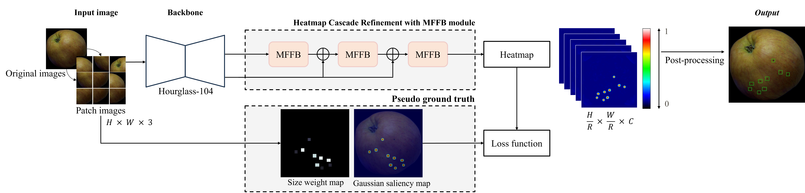

# HAFREE: A Heatmap-based Anchor-free Detector for Apple Defects


## Overview
The annual wastage of apples due to various damages poses a significant challenge in the fruit industry. Specially, the journal of apples from orchard to consumer involves in multiple static and dynamic stresses, leading to potential damage such as clipping, puctures, bruising and so on. Recognizing specific apples damage types can inform appriate actions, whether it be market placement, juice production, or disposal. Driven from the need for effective quality control, there is a strong interest in developing objective method for detect detectection in *Fuji* apples named HAFREE: A heatmap-based anchor-free for apple defects.



Apart from other works on fruit quality control by internal destructive method. By non-destrutive approach, we develop and evaluate HAFREE for automated classification and localizing the defects using RGB images.


## Getting started
### Installation
All the dependencies and required libraries are included in the [requirements.txt](requirements.txt)

1. Clone the repo
```
$ git clone https://github.com/nbngochan/HAFREE_apple_subtle_defects_detection.git
```

2. Install [Anaconda](https://docs.anaconda.com/free/anaconda/install/index.html), change your directory to the clone repo and create new conda Python virtual enviroment 'myenv'
```
$ conda create -n ENV_NAME python=3.10
$ conda activate ENV_NAME
```

3. Run the followibg command in your Terminal/Command Prompt to install the libraries required
```
conda install pytorch torchvision torchaudio pytorch-cuda=12.1 -c pytorch -c nvidia
pip install -r requirements.txt
```

### :apple: Dataset Preparation 
We used our custom apple dataset named Surface Subtle Defective Apple (SSDA) dataset which is collected from an orchard in Jangseong-gun, South Korea.

Details, further information and accessibility for SSDA dataset can refer as follows
- [The divices and details for data collection](https://www.mdpi.com/1424-8220/23/8/3968)
- [Resource of SSDA](https://zenodo.org/records/10957715)

### Usage
**1. Data Preparation** Organize the original data to be structured as.
```
.
├── SSDA Dataset
│   ├── train
|   |   └── images # Folder contains images
|   |   └── labelTxt # Folder contains annotations
|   |   └── image_lists.txt
│   ├── val
|   |   └── images
|   |   └── labelTxt
|   |   └── image_lists.txt
```

**2. Training**
```
python train.py --root /path/to/dataset/root/folder --mode_train train --mode_valid val --dataset split --backbone gaussnet_cascade --epochs 100 --alpha 0.95 --batch_size 8
```

Specific arguments is defined as follows:

<pre>
usage: train.py [-h] [--root DATASET] [--mode_train TRAIN_DIR]
                [--mode_val VAL_DIR] [--dataset CONFIG_DATASET]
                [--backbone BACKBONE] [--epochs EPOCHS]
                [--input_size INPUT_SIZE]
                [--alpha ALPHA] [--batch_size BATCH_SIZE]


optional arguments:
  -h, --help            Show this help message and exit
  --dataset             Root directory of dataset
  --mode_train          Output directory
  --mode_train
  --backbone            Chosen backbone (refer to <a href="basenet/model.py" title="backbone">available support backbone</a>)
  --img-size            Input size of image
  --epochs              Number of training epochs
  --alpha               Weight for positive loss
  --batch_size          Training batch size 
  --lr                  Learning rate
</pre>

**3. Inference**
```
python test.py --root /path/to/dataset/root/folder --dataset split --backbone gaussnet_cascade --checkpoint /path/to/trained/checkpoint
```

In detail of running *test.py* file
<pre>
usage: test.py [-h] [--root DATASET] [--dataset CONFIG_DATASET]
                [--backbone BACKBONE] [--checkpoint CHECKPOINT]
                [--input_size INPUT_SIZE] [--c_thresh C_THRESH]
                [--scale SCALE]


optional arguments:
  -h, --help            Show this help message and exit
  --dataset             Root directory of dataset
  --backbone            Chosen backbone for respective checkpoint model (refer to <a href="basenet/model.py" title="backbone">available support backbone</a>)
  --img-size            Input size of image
  --c_thresh            Threshold for center point
  --scale               Scale factor of 2D Gaussian heatmap
</pre>

### Visualization results on *SSDA val* set
Some examples from trained model on HAFREE are illutrated below. Model can well detect defects types on apple surface. 
(a) Ground-truth of samples, (b) Predicted heatmap generated from model, (c) Bounding box obtained from predicted heatmap

>Note: 🔴 represents for **scratch** type and 🟢 depicts the **pest** type.


### Acknowledgements
- IEDSP Lab create an academic environment supporting lab members.
- Juhwan Lee for leading the project and regularly meetings in a long run.

### Contact information
For any questions or inquiries, please contact nbngochan99@gmail.com or juhwanlee@jnu.ac.kr.